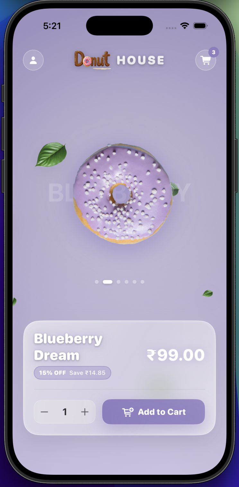
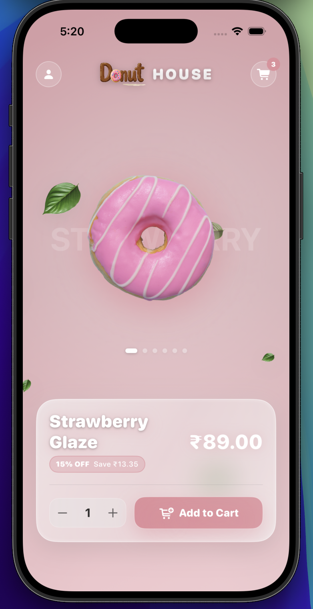
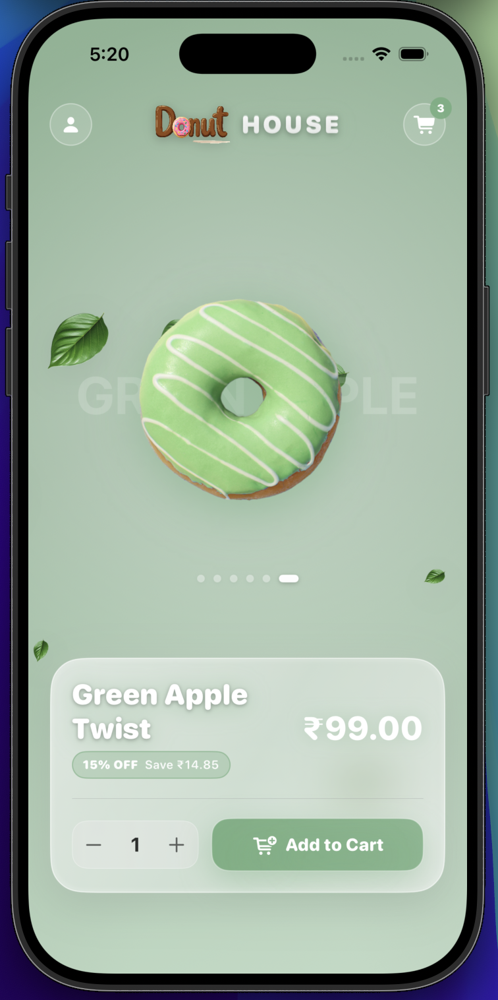
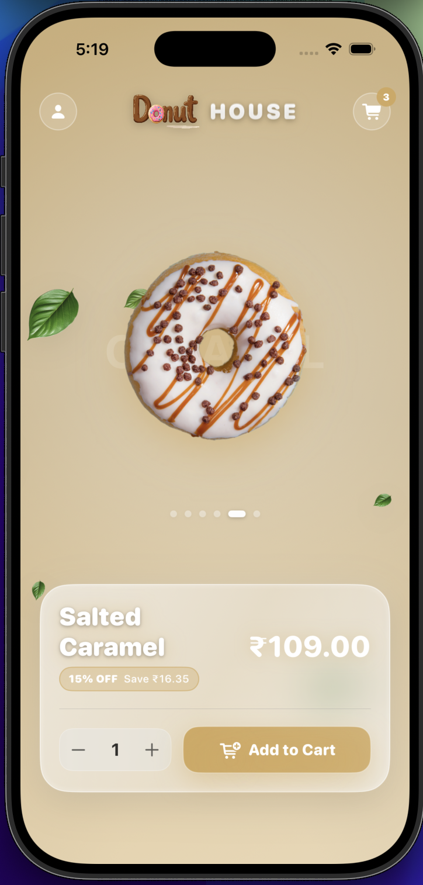

# Sweet Slider 🍩

A SwiftUI donut shop demo exploring animations, haptic feedback, and clean UI patterns.

## Features

- Hero carousel with smooth slide animations
- Haptic feedback on interactions
- Responsive quantity stepper
- Cart and profile pages
- Observable state management

## Architecture

Clean, beginner-friendly SwiftUI structure:
- **Core/** — Navigation enums and shared constants
- **Models/** — Data models with seed data
- **Stores/** — Observable state management (@Observable CartStore)
- **Components/** — Reusable UI views and styles
- **ContentView.swift** — Home screen composition
- **PagesView.swift** — Cart and Profile screens

## Getting Started

1. Open `Sweet_Slider.xcodeproj` in Xcode
2. Select the `Sweet_Slider` scheme
3. Run on iOS Simulator or device (iOS 17+)

## Next Steps

- Add ViewModels per page
- Implement persistence for cart state
- Add unit tests for CartStore
- Integrate real backend API

## UI Screenshots

Below are the current UI screens from the app.

| Home 1 | Home 2 |
|---|---|
|  |  |

| Home 3 | Home 4 |
|---|---|
|  |  |

| Cart | Profile |
|---|---|
|  |  |
